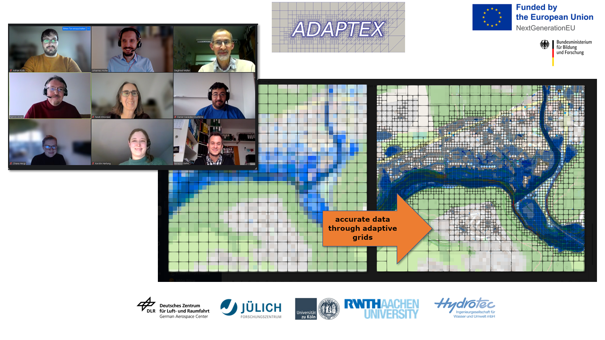

Title: Semiannual meeting 
Date: 2023-12-06 12:00 
Category: News 
Authors: Johannes Holke and Chiara Hergl

We are on track for exascale earth-system-modelling! Our ADAPTEX project team had a successful and productive semiannual meeting on Wednesday, Dezember 6.

Among other topics we discussed our GPU strategy and how we can leverage the first European exascale computer [JUPITER](https://www.fz-juelich.de/de/ias/jsc/jupiter) at 
[Forschungszentrum Jülich]([200~https://www.fz-juelich.de/). 
The framework is coming together and we are designing first test cases now.

